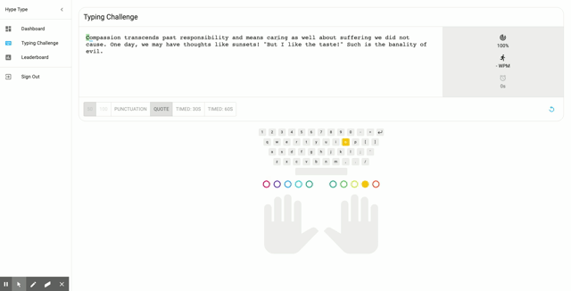
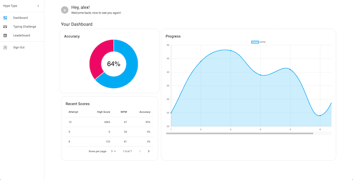
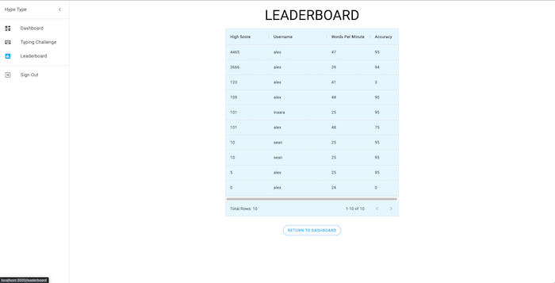

# HypeType

## Description

HypeType is a typing challenge project created in React.js. As of late, the job sector of not only web development, but computer based jobs has skyrocketed in the United States and world wide. This creates a critical need for being able to type accurately and quickly in order to be efficient at work. Many other typing games on the internet can leave you lost in a mess of complex gameplay, confusing user interfaces or a slur of advertisements. HypeType provides the user with a clean, easy to understand user experience, offering multiple options for their typing challenge. They can follow along with live updates on their words per minute and accuracy. They can also view their personal dashboard to view data about the history of their performances during challenges. 

## Table of Contents

[Description](#Description)

[Usage](#Usage)

[Contributors](#Contributors)

## Usage

___

## The Typing Challenge

The typing challenge page is where all of the action happens. You can start a challenge with different options to customize the words you are aiming to type and practice. This page comes with a keybaord and fingers that even tell you which key to type, with which finger! You are even allowed to delete and retry missed characters. Check it out in action below! 

Once you finish a challenge, you get a results page to show how you did:

## The Dashboard

The dashboard is a place where you can go to check out all of your own personal stats. See your average accuracy, your most recent scores and a graph of your progress over your last runs. Check out an example below!

## The Leaderboard

The leaderboard is the spot where you can check how you stack up again competition. It shows the top 10 scores of all time from different users. The more you practice, the more likely you will make it up there!

## Contributors

* Alisa Poon
* Bermond Batistiana
* Brandon Scott
* Sean Marten
