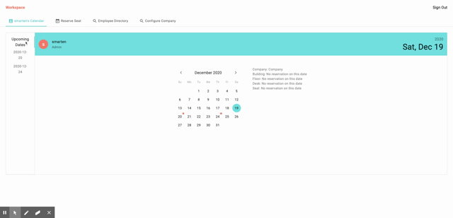
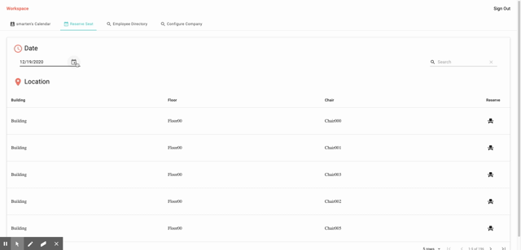
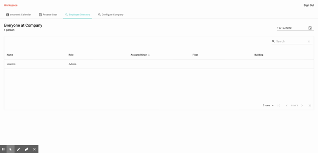
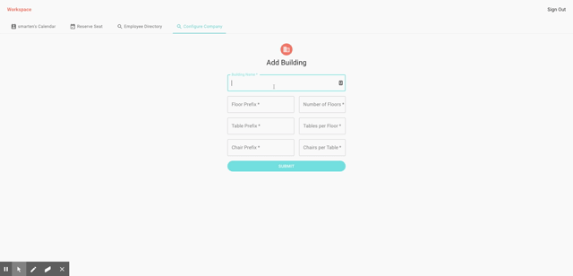

# Workspace

## Description

Workspace is an employee management system. With COVID-19 causing massive disruption to the way we work, employers need to have an easy way to manage employee seating and scheduling. Workspace allows employers to enable their employees the ability to be able to reserve a seat that they need on a certain day. Many employees don't work on site every day, and hot desking is becoming much more popular. This app caters to flexible desk scheduling for employers who want to downsize their workspace or optimize what they have. Read more below to find out more.

## Table of Contents

[Description](#Description)

[Usage](#Usage)

[Contributors](#Contributors)

## Usage

---

## The Personal Calendar

The personal calendar shows all of your current, past and upcoming dates where you have a scheduled seat.

## The Reservation

The reservation tab allows you to select a seat to reserve on a particular date.

## The Directory

The directory will show you who has a seat reserved in your company, and when.

## Configure your workspace

It is quick an easy to add configurations to your company to enable scheduling.

- Alisa Poon
- Bermond Batistiana
- Brandon Scott
- Sean Marten
